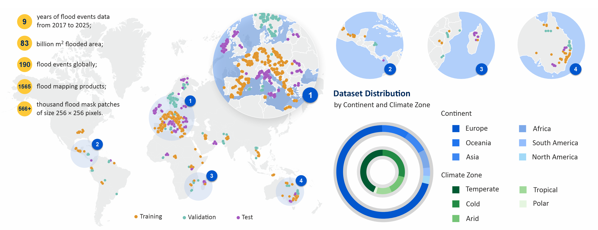

# FloodPULSEO

**A global, multi-resolution dataset for flood prediction from hydroclimatic variables and pre-event conditions.**

## Introduction

FloodPULSEO is a global satellite remote sensing dataset for deep learning (DL)-based flood extent prediction. It fuses dynamic hydroclimatic variables with static flood conditioning factors, so flood extent is predicted without relying on post-event satellite imagery. Existing flood datasets are designed mainly for segmentation of post-event imagery, which limits them wherever satellite observations of the flood are incomplete. FloodPULSEO is the first dataset developed specifically for flood extent prediction.

The dataset pairs **566,669** co-registered image patches with observed flood extents from **1,565** Copernicus Emergency Management Service (CEMS) flood mapping products, drawn from **190** rapid-mapping activations between April 2017 and December 2025 and spanning **283** river basins, six continents, and all five Köppen climate zones.




**Dataset:** [Dataverse DOI to be added] \
**Paper:** [Paper DOI link to be added]


## Data description

The dataset is delivered as patches. Each flood event is cut into square, non-overlapping tiles that each cover a 2.56 km × 2.56 km ground footprint. **One patch is five GeoTIFFs: four input files and one flood-label file.** The four input files hold the layers above, grouped by resolution, and the label file holds the CEMS flood mask. Four of the five are in the published download; `input_80m.tif` is rebuilt locally from MERIT Hydro.

| File | Bands | Size | Contents |
|---|---|---|---|
| `input_10m.tif` | 5 | 256×256 | S1 VV, S1 VH, NDVI, NDBI, permanent water |
| `input_80m.tif` † | 5 | 32×32 | MERIT elevation, flow-dir sin, flow-dir cos, UDA, HAND |
| `input_160m.tif` | 2 | 16×16 | ISRIC SoilGrids v2.0 clay %, sand % |
| `input_2560m.tif` | 2N | 1×1 | precipitation (N days), soil moisture (N days) |
| `flood_mask.tif` | 1 | 256×256 | flood label (1 = flooded) |

† Not redistributed.

Only the 10 m layers are kept at their native resolution, as a 256×256 grid. The other layers are resampled so they integrate into a single multi-modal stack: each file covers exactly the same 2.56 km × 2.56 km footprint, sampled to the grid that matches its resolution. All four grids share one origin and use exact 10 m, 80 m, 160 m and 2560 m pixels, so the four stacks and the label are pixel-aligned: a given position in `input_10m` maps to the containing cell of every coarser file. Precipitation and soil moisture reduce to one cell per tile, one value per antecedent day, so `input_2560m` holds 2N bands. The released dataset uses 30 antecedent days, giving 60 bands, 30 precipitation days followed by 30 soil-moisture days. The number of days N is configurable in the pipeline (Section below), so a newly prepared dataset can use a different window.

The permanent-water band lets a model tell pre-existing water from new flooding, while the label stays the observed CEMS inundation alone. MERIT flow direction is split into the sine and cosine of its compass angle so the circular variable has no discontinuity.

---

## Setup

```bash
conda create -n floodpulseo python=3.11
conda activate floodpulseo
pip install -r requirements.txt
```

**GEE authentication (once):**
```bash
earthengine authenticate
```

Earth Engine ties API access to a Google Cloud project, so a project registered for
Earth Engine is needed as well as the login above. If `ee.Initialize()` reports that
no project is set, register one at
[earthengine.google.com/signup](https://earthengine.google.com/signup) and select it:

```bash
earthengine set_project YOUR_PROJECT_ID
```

**Disk space.** Step 3 downloads HydroBASINS Level-12 on its first run, which is
**about 3.3 GB** and dominates the footprint of a small run; the Natural Earth
continents layer and the Köppen raster add roughly 25 MB. These are cached under
`data/` and fetched once, however many events are processed afterwards. Budget for
the event data on top: the three-event trial below comes to about 3.8 GB in total,
of which 0.5 GB is the events themselves.

---

## Download and building the dataset


This section documents the open pipeline that builds the dataset from scratch. Use it to reproduce the release or to extend it to newer activations. The pipeline produces the eight per-event layers of the overview table (the seven geospatial layers plus the flood mask) as full-scene GeoTIFFs, Step 4 tiles them into the patches described above, and Step 5 assigns the train, validation, and test split.

For layer configuration, the script-by-script walkthrough, a trial run on a few events, and troubleshooting, see [Pipeline details](docs/pipeline.md).

---

## Data catalog, metadata, and data layout

- [Data catalog and metadata](docs/dataset_catalog.md): the columns of `released_events_metadata.csv` (one row per event) and `released_patches_metadata.csv` (one row per patch), plus how the train/val/test splits are built.
- [Data layout](docs/data_layout.md): the folder structure of `data/` produced by the pipeline, including every metadata and split file.


---

## Data sources and credits

Flood labels and event metadata come from the [Copernicus Emergency Management Service Rapid Mapping](https://emergency.copernicus.eu/) service. The satellite and geospatial layers are accessed through [Google Earth Engine](https://earthengine.google.com/): Sentinel-1 and Sentinel-2 (ESA/Copernicus), MERIT Hydro, ISRIC SoilGrids v2.0, ESA WorldCover, GPM IMERG and SMAP (NASA). MERIT Hydro is CC BY-NC 4.0 / ODbL 1.0 and is not redistributed with the dataset; every other layer is redistributed under CC BY 4.0. Basin boundaries are HydroBASINS Pfafstetter Level-5, and climate zones follow the Köppen-Geiger classification.

## License

The FloodPULSEO dataset is released under CC BY 4.0, except the MERIT Hydro-derived layers, which remain under MERIT Hydro's CC BY-NC 4.0 / ODbL 1.0 and are not redistributed (see [MERIT Hydro layers are not redistributed](docs/merit_hydro.md)).

The pipeline code licence is to be added.

## Citation

A data paper describing FloodPULSEO is in preparation. Until it appears, please cite the Harvard Dataverse record.

```
[Dataverse citation to be added]
```
